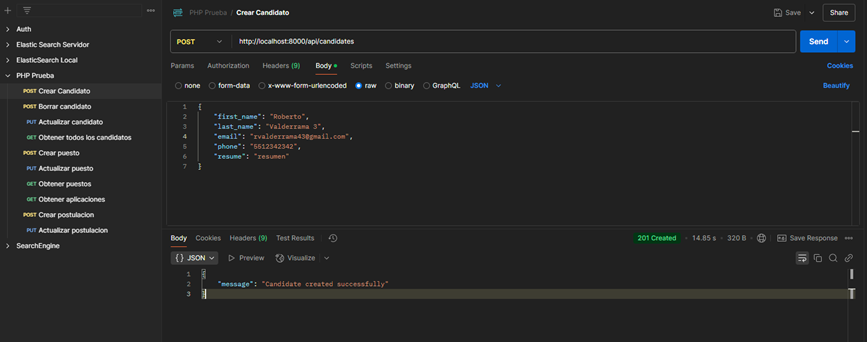
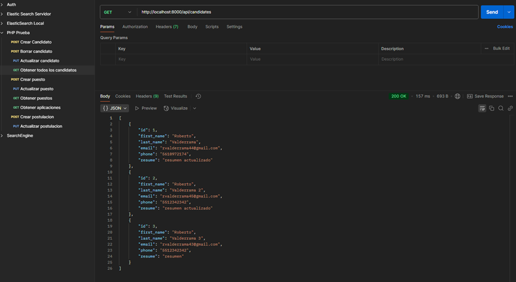
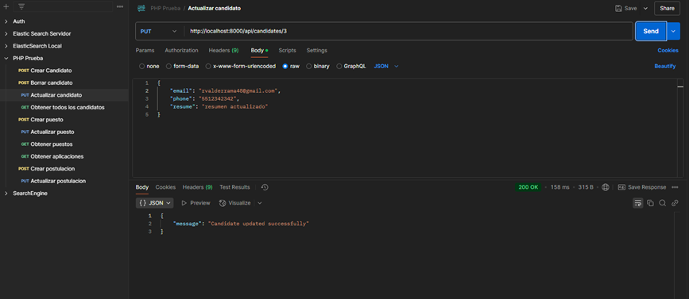
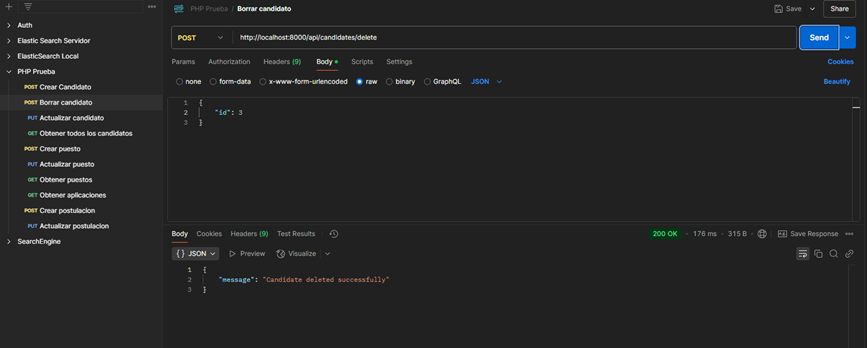
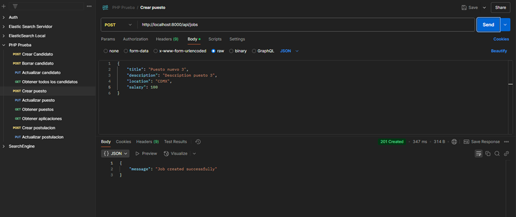
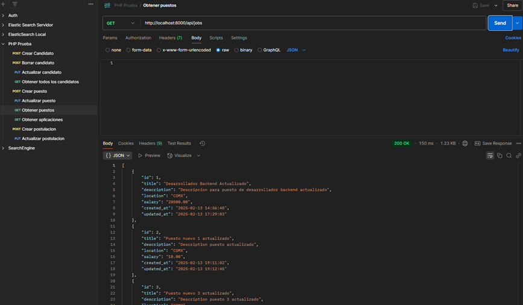
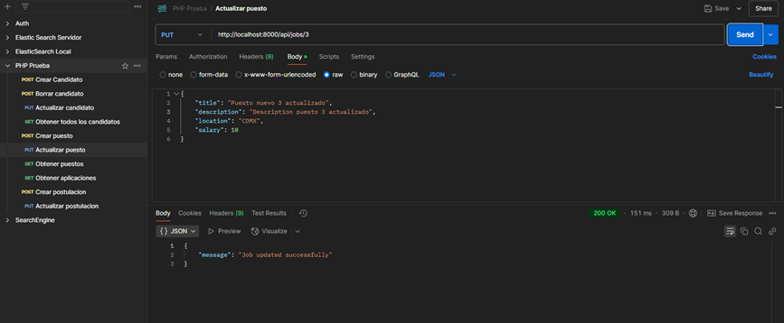
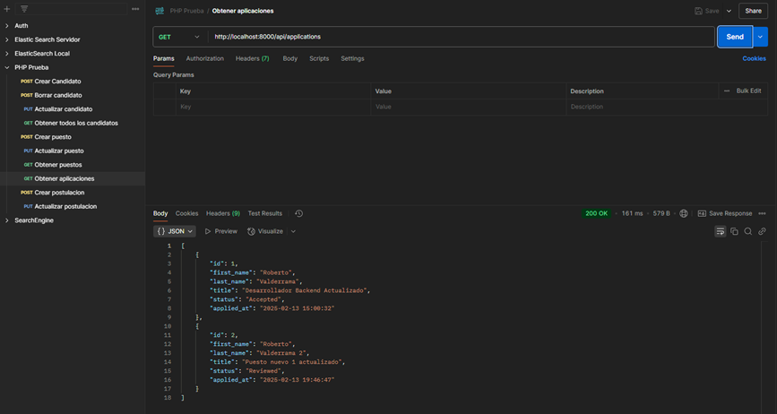
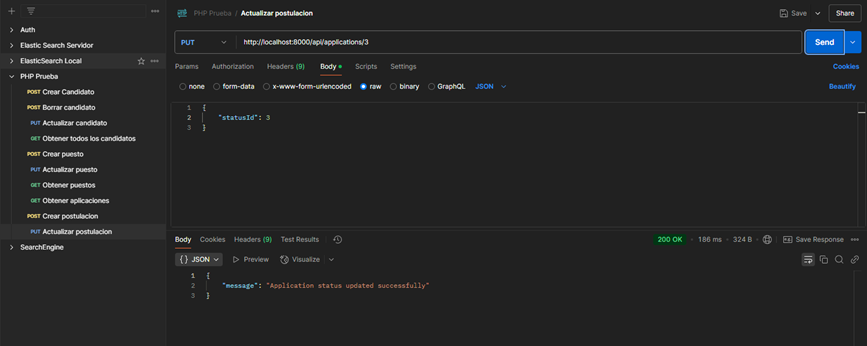

# Prueba Técnica

## Descripción

Este repositorio contiene el desarrollo de la prueba técnica, incluyendo los pasos seguidos, tecnologías utilizadas y resultados obtenidos.

La base de datos utilizada en la API, junto con los scripts SQL correspondientes, se encuentra en la carpeta [`SQL`](./SQL).

## Proceso de Desarrollo

El proceso de este desarrollo fue bastante interesante, ya que representó un reto al no contar con conocimientos previos sobre Laravel, asi como la curva de aprendizaje de PHP para desarrollar API's Rest.
A continuación, se documenta cada paso seguido para completar la prueba técnica:

1. **Configuración del entorno:**
   - Instalación de herramientas necesarias.
   - Configuración de dependencias.
   - Preparación del ambiente de desarrollo.
   - Resolución de problemas técnicos con la instalación de dependencias debido a la curva de aprendizaje de Laravel.

2. **Base de datos:**
   - Instalación y configuración de MariaDB, la tecnología utilizada en la empresa.
   - Creación de la base de datos y diseño de la estructura de las tablas.
   - Desarrollo de Store Procedures para gestionar la lógica de negocio.

3. **Desarrollo del CRUD:**
   - Implementación de las APIs en Laravel para gestionar postulaciones a puestos.
   - Desarrollo de funcionalidades para la creación de puestos, candidatos y la postulación de un candidato a un puesto.
   - Integración de los Store Procedures con Laravel.
   - Implementación de la actualización del estatus de un candidato, indicando si fue aceptado o rechazado.

4. **Problemas con Docker:**
   - Se intentó crear una imagen de Docker para compartir el proyecto.
   - Se encontraron problemas técnicos con Docker Desktop y el almacenamiento, lo que impidió generar correctamente la imagen.
   - Se investigaron comandos y configuraciones, pero no se logró resolver completamente en el tiempo disponible.

## Resultados Conseguidos

### Candidatos
Se implementaron los endpoints para gestionar candidatos. Esto incluye la creación de nuevos registros, la consulta de todos los candidatos registrados, así como la actualización y eliminación de información de un candidato.

### Jobs
Se desarrollaron los endpoints para la gestión de puestos de trabajo, permitiendo la creación, actualización y consulta de todos los puestos disponibles.

### Postulations
Se implementaron los endpoints para la creación de postulaciones de candidatos a puestos, la actualización del estatus de la postulación y la consulta de todas las postulaciones registradas.

